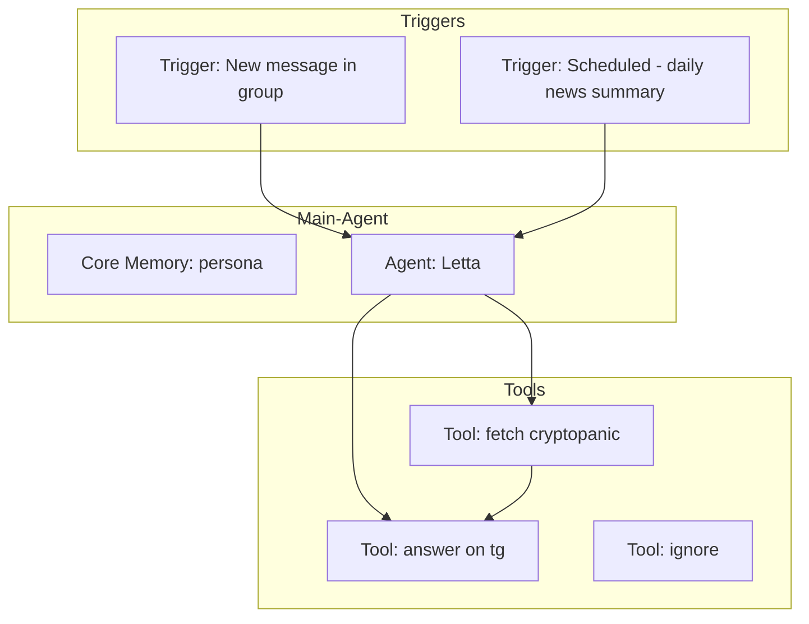

```mermaid
flowchart TD

    subgraph Triggers
        direction TB
        A1[Trigger: New message in group]
        A2[Trigger: Scheduled - daily news summary]
    end

    subgraph Main-Agent
        direction TB
        B1[Core Memory: persona]
        B2[Agent: Letta]
    end

    subgraph Tools
        direction TB
        C1[Tool: answer on tg]
        C2[Tool: fetch cryptopanic]
        C3[Tool: ignore]
    end

    %% Main-Agent triggers
    A1 --> B2 --> C1
    A2 --> B2 --> C2 --> C1
```
