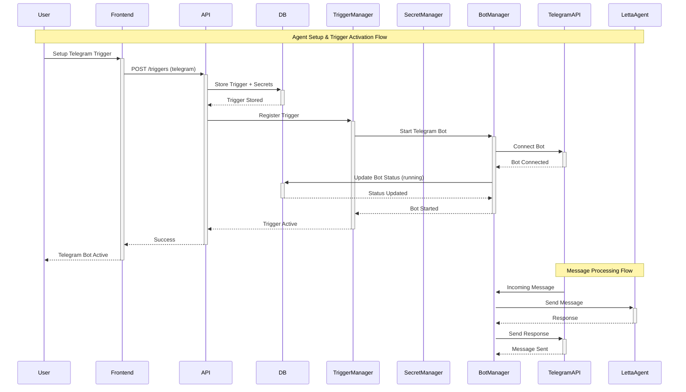

```mermaid
sequenceDiagram
    participant User
    participant Frontend
    participant API
    participant DB
    participant TriggerManager
    participant SecretManager
    participant BotManager
    participant TelegramAPI
    participant LettaAgent

    Note over User, LettaAgent: Agent Setup & Trigger Activation Flow

    User->>+Frontend: Setup Telegram Trigger
    Frontend->>+API: POST /triggers (telegram)
    API->>+DB: Store Trigger + Secrets
    DB-->>-API: Trigger Stored

    API->>+TriggerManager: Register Trigger
    TriggerManager->>+BotManager: Start Telegram Bot
    BotManager->>+TelegramAPI: Connect Bot
    TelegramAPI-->>-BotManager: Bot Connected
    BotManager->>+DB: Update Bot Status (running)
    DB-->>-BotManager: Status Updated
    BotManager-->>-TriggerManager: Bot Started
    TriggerManager-->>-API: Trigger Active
    API-->>-Frontend: Success
    Frontend-->>-User: Telegram Bot Active

    Note over TelegramAPI, LettaAgent: Message Processing Flow

    TelegramAPI->>+BotManager: Incoming Message
    BotManager->>+LettaAgent: Send Message
    LettaAgent-->>-BotManager: Response
    BotManager->>+TelegramAPI: Send Response
    TelegramAPI-->>-BotManager: Message Sent
```
