# 1xPlatform

Welcome to the **1xPlatform** repo!

This project provides a full-stack platform for managing and interacting with AI agents, featuring:
- memory management (long term memory or RAG storage)
- triggers (external events waking up the agent)
- tools (that can be used by the agent)

## Project Structure

- `app/backend/` – Node.js/Express API server supporting bots, agent management using Letta, knowledge management using Filecoin and a secret manager.
- `app/frontend/` – Modern React (Vite + Tailwind + shadcn/ui) admin dashboard for managing agents and secrets.
- `docs/` – Documentation and diagrams


## Goal
> To have great agents, you need great input.
> Great input often requires to share you campany's details to untrusted provider.
> By building the 1xPlatform, our goal is to provide a modular architecture using privacy preserving tools like Filecoin in an easy to use app.

```mermaid
graph LR
    subgraph CompanyA ["Company A"]
        SecretDoc["📄 Company's<br/>secret document<br/>🔒"]
    end
    
    subgraph CompanyB ["Company B"]
        Agent["🤖 Agent<br/>🔍"]
    end
    
    subgraph MemoryLayer ["Memory"]
        Upload["☁️ Upload"]
        Database["🗄️ Database"]
        Upload --> Database
    end
    
    subgraph ToolsLayer ["Tools"]
        SearchTool["🔍 Search Tool"]
        ListTool["📋 List Tool"]
    end
    
    subgraph FilecoinNetwork ["🪙 Filecoin Network"]
        MemoryLayer
    end
    
    SecretDoc -->|"Store"| Upload
    Database -->|"Access"| SearchTool
    Database -->|"Access"| ListTool
    SearchTool --> Agent
    ListTool --> Agent
    
    style CompanyA fill:#e3f2fd
    style CompanyB fill:#e3f2fd
    style SecretDoc fill:#fff3e0
    style Agent fill:#e8f5e8
    style Upload fill:#f3e5f5
    style Database fill:#f1f8e9
    style SearchTool fill:#fff8e1
    style ListTool fill:#fff8e1
    style FilecoinNetwork fill:#e8eaf6
```



## Quick Start

**Quick start Letta**
The project uses letta as a core ai agent framework.
To deploy it, the easiest way is to use this [one click install on railway](https://railway.com/deploy/jgUR1t) (5$ free)
After deploying it, you will have all the required .env var to start the repo

**Quick start 1x-platform**
```
git clone https://github.com/your-org/1xPlatform.git
cd 1xPlatform
# fill the .env using the app/backend/.env.template
pnpm start # start the backend
# in another terminal
pnpm start:frontend # start the frontend
```

**More advanced details**
- See [`app/backend/README.md`](app/backend/README.md) for backend setup, bot configuration, and security notes.
- See [`app/frontend/README.md`](app/frontend/README.md) for frontend usage and development.

## Live Demo - the telegram community manager

- Invite `nouny_aibot` to a Telegram group and give it admin rights so it can answer.
- Access the admin at the address: [https://1x-platform.vercel.app](1x-platform.vercel.app)
- You can directly edit the persona or even add a scheduled trigger to wake up the agent (ex: send the news every morning at 10am)


## Features

- **AI Agent Management**: Create, configure, and manage agents
- **Bot Integrations**: Connect agents to Discord and Telegram
- **Admin Dashboard**: Admin UI for agent and secret management
- **Extensible**: Add new tools, triggers, and integrations

## Tech Stack

- Backend: Node.js, Express, Letta
- Frontend: React (Vite), TailwindCSS, shadcn/ui
- Agent Infra: Filecoin (memory), Secret Manager
- Messaging: Telegram Bot API

## Complementary information

> This project is for development and demo purposes only!
> The backend currently lacks some authentication and authorization.

---

